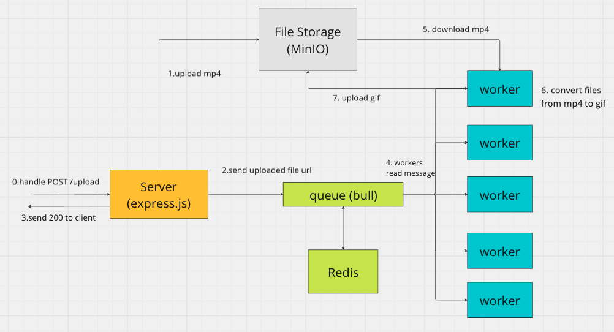

# mp4 to gif converter

### Getting Started

1. Install [Docker](https://www.docker.com/)
2. Start docker swarm cluster ```npm run start:swarm-cluster``` (may be needed```docker swarm init```)
3. UI will be available on <ADDRESS>

### Stack

Frontend:
* AngularJs as UI-javascript framework

Backend: 
* express.js as server framework
* multer for handling multipart/form-data from our api
* Bull and Redis for queues
* MinIO as S3-like file storage
* ffmpeg to convert mp4 video to gif
* mp4box for validate mp4 (is much faster than ffmpeg)

### Backend scheme



### Load test

To run simple load test execute ```npm run load-test```:

```bash
Load test startup: 1000 requests with concurrency 10...
Time taken for request: 28 seconds
Load test ended
```

As we can see, single server node can accept up to ~2000 requests per minute.

### Improvements for real production
* Change Bull(Redis) to RabbitMQ/Kafka because Redis has no guaranteed delivery mechanisms and is not scalable
* Add cleanup worker, which will be drop unused mp4 files from file storage and delete processed messages from redis